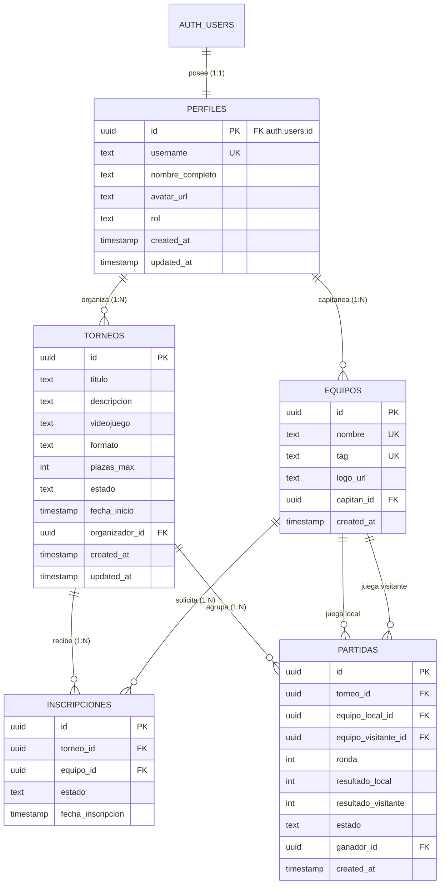

# ARCHITECTURE - Gestor de Torneos y Ligas de Videojuegos

## 1. Visión General de la Arquitectura
Para la **Práctica 1**, el backend se implementa sobre una arquitectura **Backend-as-a-Service (BaaS)** utilizando **Supabase**. 

El backend expone una **Capa de Servicios en JavaScript/Node.js** que desacopla por completo al cliente del SDK directo de Supabase y de los detalles de almacenamiento. El cliente (los futuros componentes de interfaz o la suite de pruebas) interactúa únicamente mediante métodos de servicio limpios con validación de parámetros y reglas de negocio.

```mermaid
graph TD
    Tests[Pruebas Automatizadas / Futuro Frontend] -->|Llamadas a funciones JS| ServiceLayer[Capa de Servicios]
    subgraph ServiceLayer [Capa de Servicios (src/services)]
        AuthService[authService.js]
        TorneoService[torneoService.js]
        EquipoService[equipoService.js]
        InscripcionService[inscripcionService.js]
    end
    ServiceLayer -->|Validaciones y lógica de negocio| SupabaseClient[Cliente Supabase (src/lib/supabaseClient.js)]
    SupabaseClient -->|Peticiones HTTPS con JWT| SupabaseBackend[Supabase Cloud / Local]
    subgraph SupabaseBackend [Supabase Backend]
        GoTrue[Supabase Auth (GoTrue) - Emite JWT]
        PostgREST[PostgREST API REST Automática]
        PostgreSQL[(PostgreSQL con RLS)]
    end
```

---

## 2. Tecnologías y Plataforma
- **Plataforma BaaS:** Supabase (PostgreSQL 15+, GoTrue Auth, PostgREST).
- **Entorno de Ejecución:** Node.js v20+ con módulos estándar ECMAScript (ESM).
- **Librería de Acceso:** `@supabase/supabase-js` (cliente oficial modular).
- **Framework de Pruebas:** Vitest (ejecución rápida de pruebas unitarias y de integración).
- **Control de Versiones y Metodología:** Git local y metodología SDD (Specification-Driven Development).

---

## 3. Mecanismo de Autenticación y Tokens JWT (Preparación Test ADI)
> [!IMPORTANT]
> **Preguntas clave sobre autenticación y autorización:**
> - **¿En qué iteración se implementa la autenticación?** Se implementa en la **Iteración 02 (`02-autenticacion-y-perfiles.md`)**.
> - **¿Quién genera el token JWT?** Lo genera el servidor de autenticación de Supabase (**GoTrue / Supabase Auth**) tras validar las credenciales (email y contraseña).
> - **¿Dónde y cómo se le envía al cliente?** El servidor lo envía en la respuesta JSON dentro de la propiedad `session.access_token` (junto con `refresh_token`).
> - **¿Cómo se utiliza en las peticiones posteriores?** El cliente lo adjunta automáticamente (o mediante cabeceras HTTP) como `Authorization: Bearer <access_token>`, permitiendo a PostgreSQL identificar al usuario mediante `auth.uid()` para evaluar las políticas RLS.

---

## 4. Esquema de Base de Datos y Colecciones / Tablas

### 4.1. Diagrama Entidad-Relación (Mermaid)



### 4.2. Detalle de Tablas y Restricciones
1. **`perfiles`**:
   - `id` (UUID, PK, referencia `auth.users(id)` con `ON DELETE CASCADE`).
   - `username` (TEXT, UNIQUE, longitud mínima 3).
   - `nombre_completo` (TEXT).
   - `avatar_url` (TEXT).
   - `rol` (TEXT, check `rol IN ('jugador', 'organizador', 'admin')`, por defecto `'jugador'`).
2. **`torneos`**:
   - `id` (UUID, PK, default `gen_random_uuid()`).
   - `titulo` (TEXT, NOT NULL, longitud entre 4 y 100 caracteres).
   - `descripcion` (TEXT).
   - `videojuego` (TEXT, NOT NULL: `'CS2'`, `'Valorant'`, `'Rocket League'`, `'League of Legends'`, etc.).
   - `formato` (TEXT, default `'eliminacion_directa'`).
   - `plazas_max` (INT, NOT NULL, check `plazas_max >= 2`).
   - `estado` (TEXT, NOT NULL, check `estado IN ('borrador', 'inscripcion_abierta', 'en_curso', 'finalizado', 'cancelado')`).
   - `fecha_inicio` (TIMESTAMPTZ, NOT NULL).
   - `organizador_id` (UUID, NOT NULL, referencia `perfiles(id)` o `auth.users(id)`).
3. **`equipos`**:
   - `id` (UUID, PK, default `gen_random_uuid()`).
   - `nombre` (TEXT, NOT NULL, UNIQUE).
   - `tag` (TEXT, NOT NULL, check `char_length(tag) BETWEEN 2 AND 6`).
   - `logo_url` (TEXT).
   - `capitan_id` (UUID, NOT NULL, referencia `auth.users(id)`).
4. **`inscripciones`**:
   - `id` (UUID, PK, default `gen_random_uuid()`).
   - `torneo_id` (UUID, NOT NULL, FK `torneos(id)` ON DELETE CASCADE).
   - `equipo_id` (UUID, NOT NULL, FK `equipos(id)` ON DELETE CASCADE).
   - `estado` (TEXT, check `estado IN ('confirmada', 'en_espera', 'cancelada')`).
   - `fecha_inscripcion` (TIMESTAMPTZ, default `now()`).
   - **Constraint:** `UNIQUE (torneo_id, equipo_id)` para impedir doble inscripción.
5. **`partidas`**:
   - `id` (UUID, PK, default `gen_random_uuid()`).
   - `torneo_id` (UUID, NOT NULL, FK `torneos(id)`).
   - `equipo_local_id` (UUID, NOT NULL, FK `equipos(id)`).
   - `equipo_visitante_id` (UUID, NOT NULL, FK `equipos(id)`).
   - `ronda` (INT, default 1).
   - `resultado_local` (INT, default 0).
   - `resultado_visitante` (INT, default 0).
   - `estado` (TEXT, check `estado IN ('pendiente', 'en_juego', 'finalizada')`).
   - `ganador_id` (UUID, FK `equipos(id)`).

---

## 5. Políticas de Seguridad en Base de Datos (Row Level Security - RLS)
La base de datos utiliza PostgreSQL RLS para garantizar la integridad a nivel de almacenamiento:
- **`perfiles`**: Lectura pública para perfiles (`SELECT true`). Modificación (`UPDATE`) permitida únicamente al propio usuario (`auth.uid() = id`).
- **`torneos`**: Lectura pública de torneos en estado no borrador (`SELECT true`). Creación (`INSERT`) solo usuarios autenticados (`auth.role() = 'authenticated'`). Modificación (`UPDATE`) y borrado (`DELETE`) restringido al organizador (`auth.uid() = organizador_id`).
- **`equipos`**: Creación por usuarios autenticados (`capitan_id = auth.uid()`). Modificación solo por el capitán.
- **`inscripciones`**: Lectura pública. Inserción permitida únicamente al capitán del equipo aspirante y si el torneo está en estado `'inscripcion_abierta'`. Cancelación (`DELETE`) permitida al capitán o al organizador del torneo.

---

## 6. Estructura de Carpetas del Proyecto

```text
ADI-PRACTICA/
├── docs/                                  # Documentación metodología SDD
│   ├── PROJECT_SPEC.md                    # Especificación general del proyecto
│   ├── ARCHITECTURE.md                    # Arquitectura técnica y modelos
│   ├── AI_SUMMARY.md                      # Registro global del uso de IA
│   └── iterations/                        # Documentos de cada iteración SDD
│       ├── 01-setup-y-modelo-datos.md
│       ├── 02-autenticacion-y-perfiles.md
│       ├── 03-servicio-torneos.md
│       ├── 04-servicio-inscripciones-y-equipos.md
│       └── 05-pruebas-automatizadas-y-validacion.md
├── sql/                                   # Scripts SQL para inicializar Supabase
│   ├── 01_schema.sql                      # Tablas, constraints, triggers y RLS
│   └── 02_seed.sql                        # Datos iniciales de prueba (videojuegos, torneos)
├── src/                                   # Código fuente del backend (Capa de servicios)
│   ├── lib/
│   │   └── supabaseClient.js              # Inicialización y abstracción del cliente Supabase
│   └── services/
│       ├── authService.js                 # Registro, login, JWT y perfiles
│       ├── torneoService.js               # CRUD, filtros y paginación de torneos
│       ├── equipoService.js               # Gestión de escuadras y capitanes
│       ├── inscripcionService.js          # Control de plazas e inscripciones
│       └── index.js                       # Barril de exportación de servicios
├── tests/                                 # Pruebas automatizadas (Vitest)
│   ├── authService.test.js                # Tests de autenticación y perfil
│   ├── torneoService.test.js              # Tests del recurso principal (Torneos)
│   ├── inscripcionService.test.js         # Tests de recursos secundarios (Inscripciones/Equipos)
│   └── mocks/                             # Mocks auxiliares para pruebas aisladas
│       └── mockSupabase.js                # Simulación de respuestas para CI y tests offline
├── .env.example                           # Plantilla de variables de entorno
├── .gitignore                             # Exclusión de node_modules y credenciales
├── package.json                           # Configuración del proyecto y scripts
└── README.md                              # Guía de despliegue, configuración y entrega
```

---

## 7. Capa de Servicios: Firma y Contrato de las Funciones

### `authService.js`
- `registro({ email, password, username, nombreCompleto }) -> Promise<{ user, session, profile }>`
- `login({ email, password }) -> Promise<{ user, session, token }>`
- `cerrarSesion() -> Promise<{ error }>`
- `obtenerPerfil(userId) -> Promise<{ profile }>`
- `actualizarPerfil(userId, datosActualizados) -> Promise<{ profile }>`
- `obtenerUsuarioActual() -> Promise<{ user }>`

### `torneoService.js` (Recurso Principal)
- `crearTorneo(datosTorneo, organizadorId) -> Promise<{ torneo }>`
- `listarTorneos({ page, pageSize, videojuego, estado }) -> Promise<{ torneos, total, page, totalPages }>`
- `buscarTorneos(terminoBusqueda) -> Promise<{ torneos }>`
- `obtenerTorneoPorId(id, { incluirInscripciones, incluirPartidas }) -> Promise<{ torneo }>`
- `actualizarTorneo(id, nuevosDatos, usuarioId) -> Promise<{ torneo }>`
- `eliminarTorneo(id, usuarioId) -> Promise<{ exito, id }>`

### `equipoService.js`
- `crearEquipo(datosEquipo, capitanId) -> Promise<{ equipo }>`
- `obtenerEquipoPorId(id) -> Promise<{ equipo }>`
- `listarEquiposPorCapitan(capitanId) -> Promise<{ equipos }>`

### `inscripcionService.js` (Recurso Secundario)
- `inscribirEquipo({ torneoId, equipoId, capitanId }) -> Promise<{ inscripcion }>`
- `listarInscripcionesTorneo(torneoId) -> Promise<{ inscripciones }>`
- `cancelarInscripcion(inscripcionId, capitanId) -> Promise<{ exito }>`
